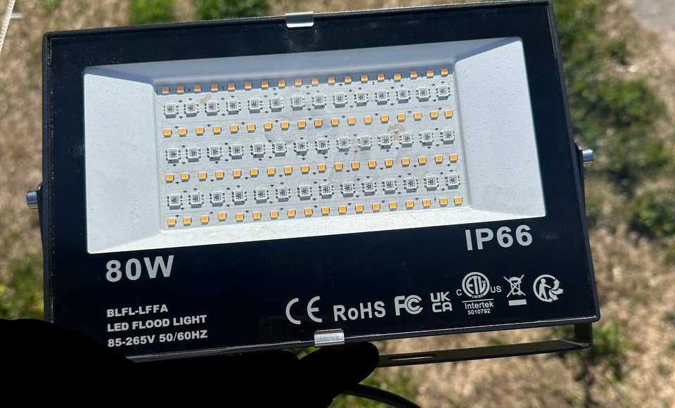
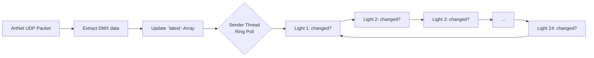

# BRMesh ArtNet Bridge

**ArtNet → BRMesh BLE Bridge for affordable LED flood lights**  
Control your BRMesh flood lights from a lighting console – no app, no MQTT, directly via DMX over ArtNet.

---

## 🎪 Background – how this project came to be

Hey there! At a festival we had 24 of these BRMesh flood lights in use. They are **80 W LED Flood Lights**, model **BLFL-LFFA**, IP66, 85–265 V 50/60 Hz, manufactured by **Apex CE Specialists** (Düsseldorf / Manchester).




The back label reads (essentially):

> ILC-BT-FL-T
>
> APP: BRmesh
> 
> LED Flood Light / LED Strahler / Projecteur LED / faretto led / foco led 85-265V 50/60Hz  

These things have a built-in Bluetooth mesh (Broadlink Fastcon / BRMesh) and can normally ONLY be controlled via the **brMesh app** on a phone. But we wanted to control them properly **via DMX** (ArtNet or sACN) from our lighting consoles.

### 💡 brMeshMQTT by ArcadeMachinist

The brilliant groundwork had already been laid by **[ArcadeMachinist/brMeshMQTT](https://github.com/ArcadeMachinist/brMeshMQTT)** – an MQTT-to-BRMesh gateway that reverse-engineered the Bluetooth communication. Special thanks also go to **[Moody](https://mooody.me/posts/2023-04/reverse-the-fastcon-ble-protocol/)** for the initial protocol analysis of the Fastcon BLE protocol. Without this work, this project would not have been possible!

My idea: take brMeshMQTT, get it running on a mini PC, and replace the MQTT part with an **ArtNet listener**. That way I can address the flood lights directly from the lighting console.

---

## 🔧 The rocky road to a solution

I had a **Beelink Mini PC** with Intel Bluetooth with me. On site, I ended up tinkering for 6-7 hours until it finally worked. Here are the key takeaways:

### It did NOT work without the BlueZ patch!

The Python implementation of brMeshMQTT talks to BlueZ via DBus. The problem: **standard BlueZ on Linux places the BLE flags at the end of the advertising payload**. However, the Broadcom chip in the BRMesh flood lights only understands it when the flags are **at the front**. That's why BlueZ **MUST** be patched and recompiled. The patch comes from Moody: [`hack-ble-flags.patch`](https://github.com/ArcadeMachinist/brMeshMQTT/blob/main/python/hack-ble-flags.patch).

> ⚠️ **Without this patch, NOTHING worked.** Only after patching and recompiling BlueZ was communication verifiably successful.

### It did NOT work on every linux device with bluetooth!

I first spent a long time developing on a **Microsoft Surface Pro 2** – no chance. It didn't work with an usb adapter that was lacking BLE support, it finally only worked on a **Beelink Mini PC** (the only device we had left with a compatible Bluetooth card). Bluetooth hardware compatibility is critical! What worked:

- **Beelink Mini PC** with Intel Bluetooth (`8087:0a2a Intel Corp. Bluetooth wireless interface`) on Ubuntu Linux with patched BlueZ
- ArcadeMachinist's USB stick `2550:8761 Realtek Bluetooth Radio` on Linux with patched BlueZ

We hung the Beelink on a beam at about **2.20 m height**, with **line of sight to the first and last BRMesh device** in the mesh chain.

---

## ⚙️ How it works – the algorithm

The code runs as a **ring polling loop**:



1. The **main thread** listens on UDP port 6454 (ArtNet) and writes incoming DMX values (R, G, B per light) into a `latest[]` array.
2. A **sender thread** loops through all N lights (default: 24) and checks whether the values have changed since the last send.
3. If yes: a Bluetooth BLE command is sent as an advertising payload – via DBus to BlueZ.
4. If RGB = (0,0,0): the light is turned off.
5. This runs **as fast as possible** sequentially in the ring – not parallel (in lack of emitting such a bluetooth command), each light one by one.



### ⚡ Maximum speed – **this is important!**

<span style="color:orange; font-weight:bold;">

The sender loop itself has **no sleep** – it runs as fast as possible. The `time.sleep(0.2)` you see in the code is only for the status monitor (display), not for the sender.

The actual bottleneck is inside the brMeshMQTT library's `single_control()` function: each BLE advertisement blocks for a configurable timeout (default: **~0.1 seconds** = 100 ms in the original brMeshMQTT code, via `shutdown(0.1)`). This value was tuned/optimized during the festival setup.

**For 24 lights, a full ring cycle takes: 24 × (BLE ad timeout) ≈ N × ~0.1 s.**  

At default settings (24 lights): **each individual light can be updated at most once every ~2.4 seconds (~0.4 Hz).** If only a single light changes, it may still take up to a full cycle before the loop reaches it again.

👉 **This is why strobe effects are impossible and color fades look very choppy.** The bottleneck is purely the sequential BLE advertisement time per light – it cannot be parallelized with the current approach (currently only making use of the existing function from brMeshMQTT which is limited to exactly one command to one light at a time only).

For fewer lights, the refresh rate improves proportionally: with 6 lights you'd get ~1.7 Hz per light, with 3 lights ~3.3 Hz. You can also tune the BLE advertisement timeout in the brMeshMQTT library's `single_control()` function for better performance.

</span>

### Important limitations
- **Strobe is way too slow** – the sequential Bluetooth transmission isn't fast enough for strobe effects.
- **Color fades are very rough** – smooth fades are barely feasible with this approach.
- It's a **proof of concept**. At least you can set a mood and put all flood lights in a color and brightness.

### Keyboard controls in the terminal (so you don't need to immediately use DMX)
- **`R`** = All lights OFF
- **`A`** = All lights PINK (test)

---

## 📋 Requirements

### Hardware
- A Linux computer (tested: Ubuntu) with a **compatible Bluetooth card** (Intel-based cards like in the Beelink worked, mine specifically shows as `8087:0a2a Intel Corp. Bluetooth wireless interface`)
- If the internal card isn't compatible: A **USB Bluetooth dongle** with BLE support, e.g. the one ArcadeMachinist used is proven to work as well: `2550:8761 Realtek Bluetooth Radio`
- **Line of sight** to the BRMesh flood lights (BLE range is limited; we used ~2.20 m height with line of sight to devices 1 and 24)

### Software
- **Linux only** – this project uses BlueZ D-Bus, GLib, and `termios`, which are Linux-specific. Tested on Ubuntu.
- **Python 3** with `dbus`, `gi.repository` (PyGObject). Install dependencies:
  ```bash
  sudo apt install python3-dbus python3-gi
  pip install -r requirements.txt
  ```
- **Patched BlueZ** (see Step 3 below) – the patch is included in this repo as `hack-ble-flags.patch`
- **brMesh app** on an Android phone (one-time setup for device configuration and mesh key extraction)
- **ADB** (Android Debug Bridge) to extract the key from the phone

> ℹ️ **Self-contained:** The BRMesh Fastcon BLE protocol implementation (reverse-engineered from brMeshMQTT) is included directly in `brmesh_artnet_bridge.py`. No external `brmesh/` module or MQTT broker needed. The `brmesh/` folder in this repo is the original gateway code kept for reference only.

### Lighting console / software
- An ArtNet-capable lighting console or software (e.g. **QLC+**, DMXControl, ChamSys, GrandMA, etc.)
- Network connection between console and bridge PC

---

## 🚀 Step-by-step guide

### Step 1: Set up flood lights with the brMesh app

1. Install the **brMesh app** on your Android phone (NOT brLight – it looks similar but uses a different protocol!)
2. Add ALL your flood lights in the app. The first light you add generates the **mesh key** – all subsequent lights use this key.
3. Make sure all flood lights are controllable in the app (on/off, color, brightness).

### Step 2: Extract the mesh key via ADB

**This is important – nothing works without the key!**

1. Activate **Developer mode** and **USB debugging** on your Android phone.
2. Connect the phone via USB to your Linux computer.
3. Check the connection:
   ```bash
   adb devices
   ```
   Your phone should be listed.

4. Start the ADB log sniffer:
   ```bash
   adb logcat | grep jyq
   ```

5. Now open the brMesh app on the phone and **toggle a flood light on/off or change its color**.

6. In the terminal, a line like this should appear:
   ```
   jyq_helper: getPayloadWithInnerRetry---> payload:220300000000000000000000,  key: b2fd16aa
   ```

7. **Your mesh key is what comes after `key:`** – in this example `b2fd16aa`.

8. Note down the key. The second byte in the payload (`03` in the example) is, by the way, the device ID of the light you toggled.

### Step 3: Patch and compile BlueZ

Without this patch, the Broadcom chip won't understand the BLE packets! The patch file (`hack-ble-flags.patch`) is included in this repo – originally from [Moody](https://github.com/moodyhunter/repo/blob/main/moody/bluez-ble-patched/hack-ble-flags.patch) via [brMeshMQTT](https://github.com/ArcadeMachinist/brMeshMQTT).

```bash
# Get BlueZ build dependencies
sudo apt-get build-dep bluez
# Download BlueZ source (version 5.64 or newer)
wget https://www.kernel.org/pub/linux/bluetooth/bluez-5.64.tar.xz
tar xf bluez-5.64.tar.xz
cd bluez-5.64

# Apply the patch from this repo
patch -p1 < ../hack-ble-flags.patch

# Compile & install
./configure --enable-experimental
make -j$(nproc)
sudo make install
sudo systemctl restart bluetooth
```

Verify:
```bash
bluetoothctl --version
# should show the patched version
```

### Step 4: BlueZ DBus configuration

Create `/etc/dbus-1/system.d/bluez-brmesh.conf`:

```xml
<!DOCTYPE busconfig PUBLIC "-//freedesktop//DTD D-BUS Bus Configuration 1.0//EN"
 "http://www.freedesktop.org/standards/dbus/1.0/busconfig.dtd">
<busconfig>
  <policy user="dired">
    <allow own="org.bluez"/>
    <allow send_destination="org.bluez"/>
    <allow send_interface="org.bluez.LEAdvertisement1"/>
    <allow send_interface="org.bluez.LEAdvertisingManager1"/>
    <allow send_interface="org.freedesktop.DBus.ObjectManager"/>
    <allow send_interface="org.freedesktop.DBus.Properties"/>
  </policy>
</busconfig>
```

Replace `dired` with your user's name (`$ whoami`).

Then:
```bash
sudo systemctl restart dbus
```

### Step 5: Clone repository and configure

```bash
git clone https://github.com/dired/BRMesh_Artnet_Bridge.git
cd BRMesh_Artnet_Bridge
```

Edit `artnet_listen.ini`:

```ini
[brmesh]
# Enter YOUR key here (from step 2):
key = [0xb2, 0xfd, 0x16, 0xaa]

[artnet]
# ArtNet Universe (QLC+ Univ 3 = ArtNet 512, Univ 1 = ArtNet 0)
universe = 512

# Number of flood lights (3 DMX channels each: R, G, B)
num_lights = 24
```

### Step 6: Start the bridge

```bash
python3 brmesh_artnet_bridge.py
```

You should see:
```
ArtNet->BRmesh | Univ:512 | 24 lights | Ring send loop
[R]=OFF [A]=PINK Ctrl+C=Exit
```

To run the bridge on startup, so that the beelink became a "standalone" device, I created a systemd-service. I omit this step from these Instructions.

### Step 7: Set up your lighting console to send artnet (not sacn) to the universe 

Configure your lighting console / software as follows:
- **ArtNet Universe**: the one configured in the INI (e.g. 512 resulted in **universe 3** for us)
- **DMX start address**: 1
- **Channel layout per light**: 3 channels (R, G, B), sequential
  - Light 1: channels 1–3
  - Light 2: channels 4–6
  - …
  - Light 24: channels 70–72

---

## 📁 Files

| File | Description |
|---|---|
| `brmesh_artnet_bridge.py` | **Self-contained monolith:** ArtNet listener + BRMesh BLE protocol + BlueZ D-Bus integration – all in one file |
| `artnet_listen.ini` | Configuration (mesh key, universe, number of lights) |
| `requirements.txt` | Python package dependencies (`dbus-python`, `PyGObject`) |
| `hack-ble-flags.patch` | BlueZ patch to fix BLE flag ordering (required, from Moody/brMeshMQTT) |
| `img/front.jpg` | Front of the flood light (BLFL-LFFA) |
| `img/back.jpg` | Back of the flood light with label |
| `img/ring_loop_animation.svg` | Animated visualization of the ring poll loop with DMX events |

---

## 🔮 Future ideas

- **"All On" / "All Off" via Bluetooth group command**: The brMesh app can control groups of flood lights all at once. If we could capture this Bluetooth command and build it into the bridge, it would be much faster than the ring poll!
- **Direct device pairing without the app**: Registering new flood lights directly from the bridge – the brMeshMQTT README hints that this is theoretically possible.
- **Performance optimization**: Speed up the ring loop, perhaps through parallel BLE advertisements.
- **sACN (E1.31) support**: As an alternative to ArtNet.

---

## 🤝 Contributing & Support

### Found a bug? Pull requests welcome!

If you find bugs or have improvements – feel free to open an issue or a pull request. I'm happy about any collaboration!

### Do you have flood lights like these or want to donate?

I don't own **any** of these devices myself – the entire development happened at a festival with borrowed flood lights. If you'd like to donate devices or support the project financially: **[PayPal Donation](https://www.paypal.com/donate/?hosted_button_id=HV5N22K48SCSQ)**

---

## 📜 Credits & Thanks

- **[ArcadeMachinist/brMeshMQTT](https://github.com/ArcadeMachinist/brMeshMQTT)** – The brilliant groundwork without which this project wouldn't have been possible. The original MQTT-to-BRMesh gateway in Node.js and Python.
- **[Moody](https://mooody.me/posts/2023-04/reverse-the-fastcon-ble-protocol/)** – For the initial reverse engineering of the Fastcon BLE protocol and the BlueZ patch.
- **Apex CE Specialists** – For the… well, the hardware. At least it's IP66! 😄

---

## 📄 License

This project, like the original brMeshMQTT, is a proof of concept.  
Check the original [brMeshMQTT repository](https://github.com/ArcadeMachinist/brMeshMQTT) for license details.

---

*Developed with lots of :heart:, little sleep, and a Beelink hanging from a beam at 2.20 m height.* 🏕️✨
